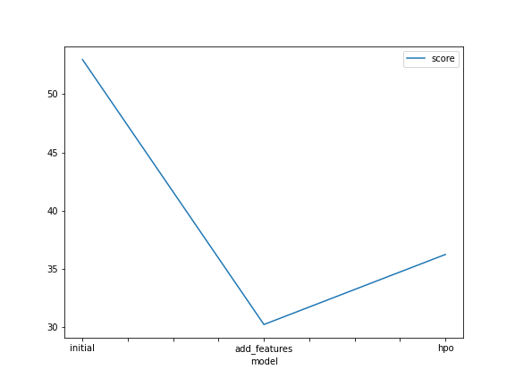
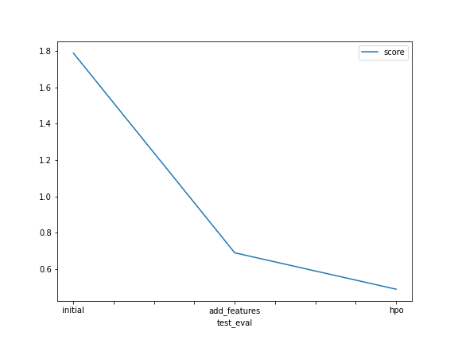

# Report: Predict Bike Sharing Demand with AutoGluon Solution
#### Arya Suneesh

## Initial Training
### What did you realize when you tried to submit your predictions? What changes were needed to the output of the predictor to submit your results?
I had to make sure that all my values were greater than zero, so that kaggle accepts my submissions. I did face some errors due to that mistake.

### What was the top ranked model that performed?
Out of all the models that were run, the model that performed the best was "WeightedEnsemble_L3". It has a score of 36.219527. 

## Exploratory data analysis and feature creation
### What did the exploratory analysis find and how did you add additional features?
I was able to split the datetime into seperate columns and converted the integer columns into categorial columns to aid the model training better.

### How much better did your model preform after adding additional features and why do you think that is?
The model performed much better after conducting the exploratory data analysis. This was because the data had become more concise and the model had more data to work with now.

## Hyper parameter tuning
### How much better did your model preform after trying different hyper parameters?
Hyperparameter tuning helped the most, as it skyrocketed the performance of the model. 

### If you were given more time with this dataset, where do you think you would spend more time?
I would spend more time in cleaning up the data, making sure there are redundancies in what I have done. Another area I would focus on would the hyperparameters. If i had some more time, I would research about all the other hyperparameters I could tweak with and implement them in the model training.

### Create a table with the models you ran, the hyperparameters modified, and the kaggle score.
|model|hpo1|hpo2|hpo3|score|
|--|--|--|--|--|
|initial|default_vals|default_vals|default_vals|1.79011|
|add_features|default_vals|default_vals|default_vals|0.68864|
|hpo|GBM: num_leaves: lower=26, upper=66|NN: dropout_prob: 0.0, 0.5|GBM: num_boost_round: 100|0.48788|

### Create a line plot showing the top model score for the three (or more) training runs during the project.

TODO: Replace the image below with your own.

### Create a line plot showing the top kaggle score for the three (or more) prediction submissions during the project.

TODO: Replace the image below with your own.

## Summary
I was able to implement a lot of the knowledge I had learnt in the course and even delved deeper into the Autogluon framework. I understood the importance of exploratory data analysis and hyperparameter tuning in regards to boosting the performance of the model training as well. 
